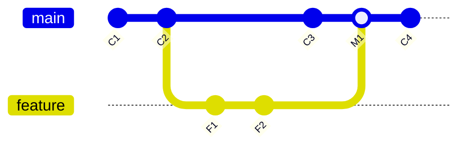
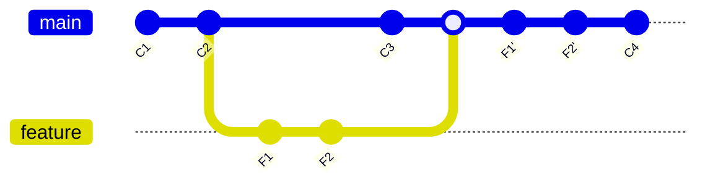
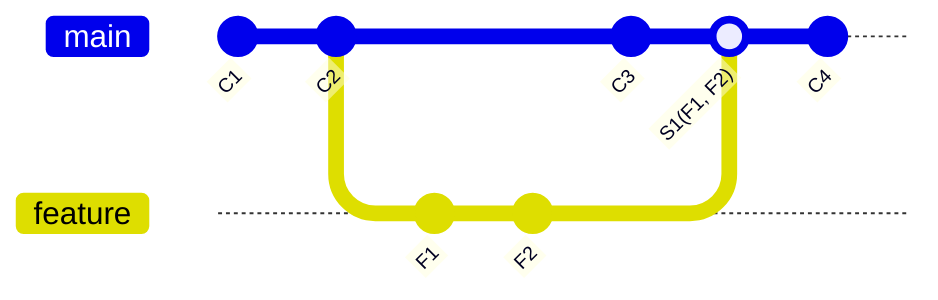

# GitHub Merge 方針

## Merge Commit

- main ブランチに feature ブランチをマージした結果、新しいマージコミット M1 が作成される
- 履歴に分岐と統合がそのまま残る

## Rebase and Merge

- feature ブランチのコミット F1, F2 が main ブランチの最新コミット C3 の後ろに並び替えられる（F1'と F2'）
- 新しいコミットとして統合され、履歴が直線的になる。マージコミットは作られない

## Squash and Merge

- feature ブランチの複数のコミット F1, F2 が 1 つのコミット S1 にまとめられて main に統合される
- 履歴がシンプルになるが、元の細かいコミット履歴は失われる

## Markdown 記法による比較表

| マージ方法           | 特徴                                                             | 利点                                     | 欠点                                 |
| -------------------- | ---------------------------------------------------------------- | ---------------------------------------- | ------------------------------------ |
| マージコミット       | ブランチをそのまま統合し、マージコミットを作成する               | 履歴が残り、ブランチの流れが分かりやすい | 履歴が増え、複雑になることがある     |
| リベースしてマージ   | ブランチのコミットをベースブランチの先頭に付け替える（リベース） | 履歴が直線的になり、シンプルになる       | 履歴の書き換えにより、競合リスクあり |
| スカッシュしてマージ | ブランチの複数コミットを 1 つにまとめてマージする                | 履歴がシンプルになり、管理が楽になる     | 元の細かいコミット履歴が失われる     |
