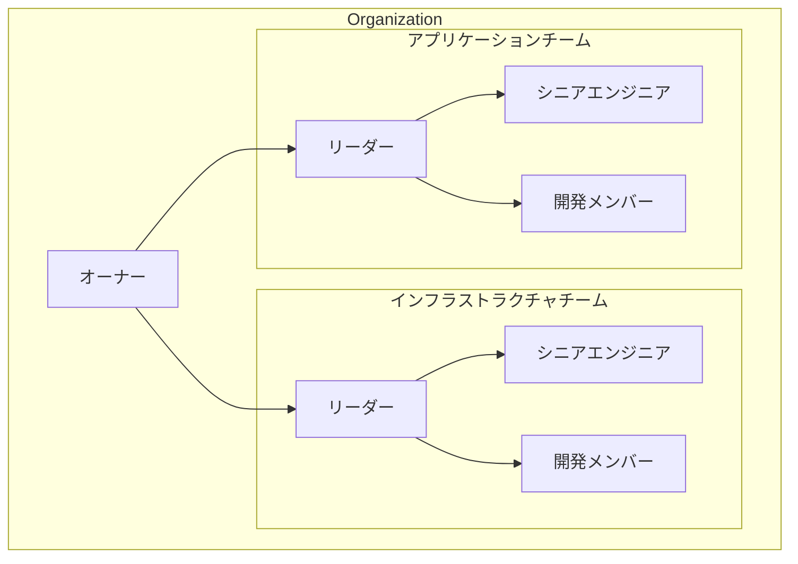

# GitHub Organization 基本設計書

## 1. 概要

### 1.1 目的

本設計書は、プロジェクトにおける GitHub Organization の利用方針および運用ルールを定義することを目的としています。この設計書に基づいて開発プロセスを標準化し、効率的なチーム開発とコード品質の向上を実現します。

本書で定義する内容は以下の通りです：

- チーム構造とロールの定義
- 権限管理とアクセス制御
- レビュープロセスとワークフロー
- セキュリティとコンプライアンスの基準

### 1.2 対象範囲

本設計書は、インフラストラクチャチームとアプリケーションチームによる GitHub Organization の利用に関する基本的な設計を定義します。具体的には、組織構造、権限管理、リポジトリ運用、開発ワークフロー、品質管理の各側面について規定します。
なお、CI/CD パイプラインやコーディングルールなどは別途定める開発ガイドラインにて規定するものとし、本設計書の対象外とします。

### 1.3 対象読者

本設計書は、以下の役割を持つメンバーを対象としています：

| メンバー         | 役割                                                          |
| ---------------- | ------------------------------------------------------------- |
| オーナー         | GitHub の管理者、プロジェクトマネージャー、プロダクトオーナー |
| チームリーダー   | チームの責任者                                                |
| シニアエンジニア | 上級開発エンジニア                                            |
| 開発メンバー     | 開発エンジニア                                                |

### 1.4 用語定義

| 用語            | 説明                                                               |
| --------------- | ------------------------------------------------------------------ |
| Organization    | GitHub の組織アカウント。複数のリポジトリやチームを管理する単位    |
| Repository      | ソースコードやドキュメントの格納場所。バージョン管理される最小単位 |
| Team            | Organization 内のグループ単位。権限やアクセス制御の管理単位        |
| Branch          | リポジトリ内のコード分岐。並行開発を可能にする機能                 |
| Pull Request    | コードレビューと変更の統合プロセス                                 |
| Issue           | タスク・バグ・要望の管理単位                                       |
| Review          | コードやドキュメントのレビュープロセス                             |
| Approve         | レビュー完了後の承認                                               |
| Merge           | ブランチの統合作業                                                 |
| Protection Rule | ブランチの保護設定                                                 |

## 2. Organization 設計

### 2.1 Organization 構成

GitHub におけるOrgnizationの基本構造を以下のように定義します。



この組織構造により、以下の効果を実現します。

- チーム構造の可視化
- チーム単位での権限管理
- 責任範囲の明確化

### 2.2 メンバーの役割定義

各メンバーの役割を以下のように定義します。

| メンバー         | 主な役割                                                                 |
| ---------------- | ------------------------------------------------------------------------ |
| オーナー         | システム全体の品質保証、本番環境の管理                                   |
| リーダー         | アーキテクチャ設計、チーム開発方針の策定、コードの最終承認               |
| シニアエンジニア | 開発メンバーの役割に加え、技術的判断、コードレビュー、メンバーの技術支援 |
| 開発メンバー     | 機能実装、ユニットテスト作成、ドキュメント作成                           |

## 2.3 権限定義

GitHubにおける権限は以下の3つのレベルに分かれています。
それぞれのレベルにはロールがあり、以下ではそのロールを示します。

### Organization レベルのロール

Organization 全体に対する権限を定義するロールです。

| ロール | 説明                                                                          |
| ------ | ----------------------------------------------------------------------------- |
| Owner  | Organization の管理者権限。全ての設定変更、メンバー管理、支払い管理などが可能 |
| Member | Organization のメンバーとして基本的な操作が可能                               |

### GitHub の Team レベルのロール

Team 内での権限を定義するロールです。

| ロール     | 説明                                                            |
| ---------- | --------------------------------------------------------------- |
| Maintainer | チームの管理者権限。メンバーの追加・削除、Team 設定の変更が可能 |
| Member     | チームのメンバーとして基本的な操作が可能                        |

### GitHub の Repository レベルロール

リポジトリに対する権限を定義するロールです。

| ロール   | 説明                                                       |
| -------- | ---------------------------------------------------------- |
| Admin    | リポジトリの管理者権限。全ての設定変更とアクセス管理が可能 |
| Maintain | リポジトリの管理（設定変更を除く）とコードの変更が可能     |
| Write    | コードの変更と Pull Request の作成が可能                   |
| Triage   | Issue や Pull Request の管理が可能（コード変更不可）       |
| Read     | 読み取りのみ可能                                           |

### メンバーへのロール割り当て

| メンバー区分     | Organization Role | Team Role  | Repository Role | 説明                               |
| ---------------- | ----------------- | ---------- | --------------- | ---------------------------------- |
| オーナー         | Owner             | -          | Admin           | 組織全体の管理権限を持つ           |
| チームリーダー   | Member            | Maintainer | Maintain        | チーム管理とコードの承認権限を持つ |
| シニアエンジニア | Member            | Member     | Write           | コード変更と一部承認権限を持つ     |
| 開発メンバー     | Member            | Member     | Write           | 基本的なコード変更権限を持つ       |

### 操作権限マトリクス

| 操作権限               | オーナー | リーダー | シニア | メンバー |
| ---------------------- | :------: | :------: | :----: | :------: |
| **Organization Level** |
| Organization 設定変更  |    ✅    |    ❌    |   ❌   |    ❌    |
| Team 作成・削除        |    ✅    |    ❌    |   ❌   |    ❌    |
| メンバー管理           |    ✅    |    ❌    |   ❌   |    ❌    |
| Billing 管理           |    ✅    |    ❌    |   ❌   |    ❌    |
| **Team Level**         |
| Team 設定変更          |    ✅    |    ✅    |   ❌   |    ❌    |
| Team メンバー管理      |    ✅    |    ✅    |   ❌   |    ❌    |
| **Repository Level**   |
| リポジトリ作成         |    ✅    |    ✅    |   ❌   |    ❌    |
| リポジトリ設定変更     |    ✅    |    ✅    |   ❌   |    ❌    |
| ブランチ保護設定       |    ✅    |    ✅    |   ❌   |    ❌    |
| Webhooks 設定          |    ✅    |    ✅    |   ❌   |    ❌    |
| セキュリティ設定       |    ✅    |    ✅    |   ❌   |    ❌    |
| PR のマージ（main）    |    ✅    |    ❌    |   ❌   |    ❌    |
| PR のマージ（staging） |    ✅    |    ✅    |   ❌   |    ❌    |
| PR のマージ（develop） |    ✅    |    ✅    |   ❌   |    ❌    |
| PR のレビュー          |    ✅    |    ✅    |   ✅   |    ✅    |
| Issue 管理             |    ✅    |    ✅    |   ✅   |    ✅    |
| コードの Push          |    ✅    |    ✅    |   ✅   |    ✅    |

### コードレビュー承認の制御

GitHub の Code Owners 機能を使用して、以下のようにレビュー承認権限を制御します：

```bash
# デフォルトのCode Owner設定
*                   @senior-engineers @team-leaders

# mainブランチ全体の所有者設定
# mainブランチへのすべての変更にオーナーの承認が必要
main                @organization-owners

# stagingブランチ全体の所有者設定
# stagingブランチへのすべての変更にチームリーダーの承認が必要
staging             @team-leaders

# developブランチ全体の所有者設定
develop             @senior-engineers @team-leaders
```

#### 承認ルール

各環境に対する承認ルールを以下のように設定します：

| 環境                    | 必要な承認者     | 説明                                                               |
| ----------------------- | ---------------- | ------------------------------------------------------------------ |
| 本番（main）            | オーナー         | • オーナーの承認が必須<br>• リーダーのレビューを推奨               |
| ステージング（staging） | チームリーダー   | • チームリーダーの承認が必須<br>• シニアエンジニアのレビューを推奨 |
| 開発（develop）         | シニアエンジニア | • シニアエンジニアの承認が必須                                     |

## 3. レビュー方針

### 3.1 プルリクエスト作成ガイドライン

以下のテンプレートを使用して PR を作成します：

```markdown
## 概要

変更内容の概要を記載してください。

## 変更内容

- 具体的な変更点をリストアップしてください
- できるだけ箇条書きで記載してください

## 影響範囲

この変更による影響範囲を記載してください。

## テスト内容

- [ ] 実施したテストをチェックリスト形式で記載
- [ ] ユニットテストの実施
- [ ] 動作確認の実施

## 関連情報

関連する PR、Issue、ドキュメントへのリンクを記載してください。
```

#### 説明文の記載ルール

| 項目       | 記載内容             | 例                                   |
| ---------- | -------------------- | ------------------------------------ |
| 概要       | 変更の目的と全体像   | 「ログイン機能のパフォーマンス改善」 |
| 変更内容   | 技術的な変更点       | 「セッション管理を Redis に移行」    |
| 影響範囲   | 変更の影響が及ぶ機能 | 「認証機能全般、特にセッション周り」 |
| テスト内容 | 実施した検証項目     | 「負荷テスト、セッション永続化確認」 |

#### 関連チケットの紐付け

PR の説明文に以下の形式で記載します：

```
Related to: #123
Fixes: #456
```

### 3.2 レビュー実施ガイドライン

#### レビュアー指名のルール

- 必要レビュアー数：最低 1 名
- 指名基準：
  - インフラ変更：Infrastructure Team のシニアエンジニア以上
  - アプリケーション変更：Application Team のシニアエンジニア以上
  - 共通部分の変更：両チームのレビュアーが必要

#### レビュー期間

| 変更の種類     | 標準期間     | 緊急時の期間 |
| -------------- | ------------ | ------------ |
| 軽微な変更     | 1 営業日以内 | 2 時間以内   |
| 通常の機能追加 | 2 営業日以内 | 4 時間以内   |
| 大規模な変更   | 3 営業日以内 | 1 営業日以内 |

#### レビューコメントの記載方法

```markdown
[種類: 提案/問題点/質問]
指摘内容を具体的に記載

理由：
なぜその指摘が必要なのかの説明

提案：
改善案がある場合は具体的に記載
```

### 3.3 フィードバック手順

#### コメントの種類と対応

| コメントの種類 | 内容             | 必須対応 |
| -------------- | ---------------- | -------- |
| Must Fix       | 重大な問題の指摘 | 必須     |
| Suggestion     | 改善提案         | 任意     |
| Question       | 実装に関する質問 | 回答必須 |
| Nitpick        | 軽微な指摘       | 任意     |

#### 指摘事項への対応方法

1. すべてのコメントに返信する
2. 対応完了後は Resolve する
3. 大きな修正が必要な場合は新しいコミットを作成
4. 軽微な修正は既存のコミットに追加（`git commit --amend`）

### 3.4 承認フロー

#### 環境別の承認ルール

```markdown
Develop 環境

- シニアエンジニアまたはチームリーダーの承認が必要
- CI/CD のすべてのチェックがパス
- 必要なレビューコメントへの対応完了

Staging 環境

- チームリーダーの承認が必要
- Develop 環境での動作確認完了
- 結合テストのパス

Production 環境

- オーナーの承認が必要
- Staging 環境での検証完了
- セキュリティチェックのパス
```

#### 承認基準

| 確認項目     | 基準                                                                         |
| ------------ | ---------------------------------------------------------------------------- |
| コードの品質 | - コーディング規約に準拠<br>- 適切なテストの実装<br>- パフォーマンスへの考慮 |
| ドキュメント | - 必要な設計書の更新<br>- API ドキュメントの更新<br>- 変更履歴の記録         |
| セキュリティ | - 脆弱性の未使用<br>- 適切な認証・認可<br>- 機密情報の非公開                 |

#### 差し戻し時の対応

1. レビュアーは差し戻しの理由を明確に記載
2. 開発者は以下の手順で対応：
   - 指摘事項の確認と理解
   - 修正方針の策定と共有
   - 修正の実施と再テスト
   - 変更内容の説明を追記
3. 再レビューの依頼
