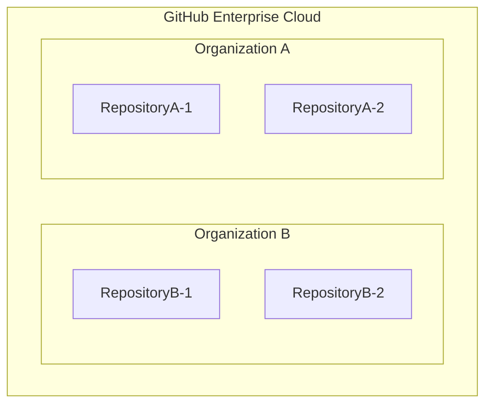
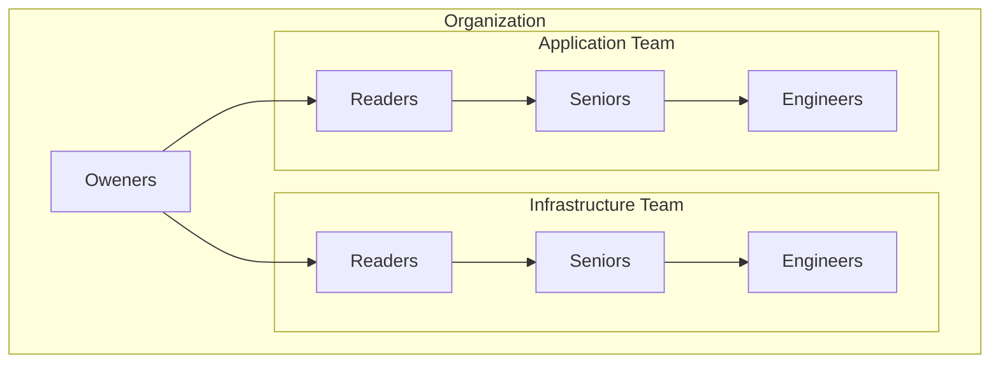

# GitHub Organization 基本設計書

## 1. 概要

### 1.1 目的

本設計書は、プロジェクトにおける GitHub Organization の利用方針および運用ルールを定義することを目的としています。この設計書に基づいて開発プロセスを標準化し、効率的なチーム開発とコード品質の向上を実現します。

本書で定義する内容は以下の通りです：

- チーム構造とロールの定義
- 権限管理とアクセス制御
- レビュープロセスとワークフロー
- セキュリティとコンプライアンスの基準

### 1.2 対象範囲

本設計書、GitHub Enterprise Cloudにおける Organization の利用に関する基本的な設計を、組織構造、権限管理、リポジトリ運用、開発ワークフロー、品質管理の各側面について規定します。

CI/CD パイプライン、コーディングルールなどは別途定める開発ガイドラインにて規定するものとし、本設計書の対象外とします。
また、GitHub Enterpriseの設計についても本設計の対象外とします。GitHub Enterprise CloudとGitHub Organizationの関係を以下の図に示します。



GitリポジトリはOrganization単位で管理され、プロジェクト単位にOrganizationを割り当て権限管理をすることで、お互いのプロジェクトのリポジトリを参照できないようにします。

### 1.3 対象読者

本設計書は、以下の役割を持つメンバーを対象としています：

| メンバー | 役割 |
| --- | --- |
| オーナー | GitHub の管理者、プロジェクトマネージャー、プロダクトオーナー |
| チームリーダー | チームの責任者 |
| シニアエンジニア | 上級開発エンジニア |
| エンジニア | 開発エンジニア |

### 1.4 用語定義

| 用語 | 説明 |
| --- | --- |
| Organization| GitHub の組織アカウント。複数のリポジトリやチームを管理する単位 |
| Repository | ソースコードやドキュメントの格納場所。バージョン管理される最小単位 |
| Team | Organization 内のグループ単位。権限やアクセス制御の管理単位 |
| Branch | リポジトリ内のコード分岐。並行開発を可能にする機能 |
| Pull Request | コードレビューと変更の統合プロセス |
| Issue | タスク・バグ・要望の管理単位 |
| Review | コードやドキュメントのレビュープロセス |
| Approve | レビュー完了後の承認 |
| Merge | ブランチの統合作業 |
| Protection Rule | ブランチの保護設定 |

## 2. Organization 設計

### 2.1 メンバーの役割定義

Organizationに所属するメンバーの役割を以下のように定義します。

| メンバー  | 主な役割 |
| --- | --- |
| オーナー | システム全体の品質保証、本番環境の管理 |
| リーダー | アーキテクチャ設計、チーム開発方針の策定、コードの最終承認 |
| シニアエンジニア | 開発メンバーの役割に加え、技術的判断、コードレビュー、メンバーの技術支援 |
| エンジニア | 機能実装、ユニットテスト作成、ドキュメント作成 |

### 2.2 Team 構成

GitHub におけるOrgnization内のTeam機能を使用し、以下の階層構造で権限管理を行います。



各Teamに所属するメンバーを以下に示します。

| Team | 所属メンバー |
|------|---|
| Owners | オーナー |
| Application | アプリチームのメンバー |
| Application/Readers | アプリチームのリーダー |
| Application/Seniors | アプリチームのシニアエンジニア |
| Application/Engineers | アプリチームのエンジニア |
| Infrastructure | インフラチームメンバー |
| Infrastructure/Readers | インフラチームのリーダー |
| Infrastructure/Seniors | インフラチームのシニアエンジニア |
| Infrastructure/Engineers | インフラチームのエンジニア |

この組織構造により、以下を実現します。

1. 柔軟なメンバー管理
    - 個人をTeamに所属させることで、個人の指定なしで権限管理が可能
    - メンバーの昇格時はTeamの所属を変更するだけで権限が自動的に更新
    - 退職時はTeamから削除するだけで全ての権限が削除

2. 段階的な権限付与
    - Members: 基本的な開発権限
    - Seniors: レビュー承認権限
    - Leaders: 環境固有の承認権限

### 2.3 権限定義

GitHubにおける権限は以下の3つのレベルに分かれています。

- Organization
- Team
- Repository

それぞれのレベルにはロールがあり、以下でそのロールを示します。

#### Organization レベルのロール

Organization 全体に対する権限を定義するロールです。

| ロール | 説明 |
| --- | --- |
| Owner  | Organization の管理者権限。全ての設定変更、メンバー管理、支払い管理などが可能 |
| Member | Organization のメンバーとして基本的な操作が可能 |

#### GitHub の Team レベルのロール

Team 内での権限を定義するロールです。

| ロール | 説明 |
| --- | --- |
| Maintainer | チームの管理者権限。メンバーの追加・削除、Team 設定の変更が可能 |
| Member | チームのメンバーとして基本的な操作が可能 |

#### GitHub の Repository レベルロール

リポジトリに対する権限を定義するロールです。

| ロール   | 説明 |
| --- | --- |
| Admin | リポジトリの管理者権限。全ての設定変更とアクセス管理が可能 |
| Maintain | リポジトリの管理（設定変更を除く）とコードの変更が可能 |
| Write | コードの変更と Pull Request の作成が可能 |
| Triage | Issue や Pull Request の管理が可能（コード変更不可） |
| Read | 読み取りのみ可能 |

### 2.4 承認権限の設定

#### Teamへのロール割り当て

各レベルのロールをTeamに割り当てることでTeamに対して適切な権限設定を行います。

| Team | Organization Role | Team Role | Repository Role |
| --- | --- | --- | --- |
| Owners| Owner | - | - |
| Application | Member | - | - |
| Application/Leaders | Member | Maintainer | Admin |
| Application/Seniors | Member | Maintainer | Maintain |
| Application/Engineers | Member | Member | Write |
| Infrastructure | Member | - | - |
| Infrastructure/Leaders | Member | Maintainer | Admin |
| Infrastructure/Seniors | Member | Maintainer | Maintain |
| Infrastructure/Engineers | Member | Member | Write |

（補足）ApplicationとInfrastructureのTeamには具体的な権限を付与せず、論理的なグループとしてのみ使用します。

#### ブランチ保護ルール

各ブランチには以下の保護ルールを設定します。

| ブランチ | 必要な承認 | マージ権限 | 追加設定 |
| --- |-----------|------------|----------|
| production | Ownersの承認 | Owners のみ | 承認必須、ステータスチェック必須 |
| staging | Leaders の承認 | Leaders のみ | 承認必須、ステータスチェック必須 |
| develop | Seniors/Leaders の承認 | Write権限保持者 | 承認必須、ステータスチェック必須 |

#### Code Ownersの設定

各ブランチに対して.github/CODEOWNERSの設定をすることで、ブランチ全体に対する制限を設定します。

```text
# デフォルトのCode Owner設定
*                   @Organization/Infrastructure/Seniors @Organization/Application/Seniors
                    @Organization/Infrastructure/Leaders @Organization/Application/Leaders

# productionブランチ全体の所有者設定
production          @Organization/Owners

# stagingブランチ全体の所有者設定
staging             @Organization/Infrastructure/Leaders @Organization/Application/Leaders

# developブランチ全体の所有者設定
develop             @Organization/Infrastructure/Seniors @Organization/Application/Seniors
                    @Organization/Infrastructure/Leaders @Organization/Application/Leaders
```

#### 権限の優先順位

GitHubにおける権限制御は、以下の順序で優先されます。

1. Branch Protection Rules / CODEOWNERS（最優先）
   - ブランチごとの保護設定
   - マージ制限、承認要件
   - コードオーナーの指定
   - 例：productionブランチへのマージにはOwnerの承認が必須

2. Repository Level（中間）
   - リポジトリごとの権限設定
   - Repository Role（Admin, Maintain, Write等）による基本権限
   - 例：Admin権限を持っていても、Branch Protectionの制限は上書きできない

3. Organization Level（最低位）
   - Organization全体の設定
   - TeamやMemberの基本権限
   - 例：Organization MemberであってもRepository権限がなければアクセス不可

この優先順位により、上位の設定が下位の設定を上書きします。例えば、Repository RoleでAdmin権限を持つユーザーでも、Branch ProtectionやCODEOWNERSの設定により、特定のブランチへのマージや承認が制限されます。

### 2.5 操作権限マトリクス

| 操作権限               | オーナー | リーダー | シニアエンジニア | エンジニア |
| ---------------------- | :------: | :------: | :----: | :------: |
| **Organization Level** | | | | |
| Organization 設定変更  |    ✅    |    ❌    |   ❌   |    ❌    |
| Team 作成・削除        |    ✅    |    ❌    |   ❌   |    ❌    |
| メンバー管理           |    ✅    |    ✅*   |   ✅*  |    ❌    |
| Billing 管理           |    ✅    |    ❌    |   ❌   |    ❌    |
| **Team Level**         | | | | |
| Team 設定変更          |    ✅    |    ✅*   |   ✅*  |    ❌    |
| Team メンバー管理      |    ✅    |    ✅*   |   ✅*  |    ❌    |
| **Repository Level**   | | | | |
| リポジトリ作成         |    ✅    |    ✅    |   ❌   |    ❌    |
| リポジトリ設定変更     |    ✅    |    ✅    |   ✅   |    ❌    |
| ブランチ保護設定       |    ✅    |    ✅    |   ❌   |    ❌    |
| Webhooks 設定          |    ✅    |    ✅    |   ❌   |    ❌    |
| セキュリティ設定       |    ✅    |    ✅    |   ❌   |    ❌    |
| PR のマージ（main）    |    ✅    |    ❌    |   ❌   |    ❌    |
| PR のマージ（staging） |    ✅    |    ✅    |   ✅   |    ❌    |
| PR のマージ（develop） |    ✅    |    ✅    |   ✅   |    ✅    |
| PRの承認（main）       |    ✅    |    ❌    |   ❌   |    ❌    |
| PRの承認（staging）    |    ✅    |    ✅    |   ❌   |    ❌    |
| PRの承認（develop）    |    ✅    |    ✅    |   ✅   |    ❌    |
| PR のレビュー          |    ✅    |    ✅    |   ✅   |    ❌    |
| Issue 管理             |    ✅    |    ✅    |   ✅   |    ✅    |
| コードの Push          |    ✅    |    ✅    |   ✅   |    ✅    |

- ✅* は「自身が所属するTeamのみ可能」を示します。

***(ここまで)***

## 3. リポジトリ設計

### 3.1 保護ブランチの設定

GitHubのブランチ保護機能を利用して、ブランチ（production、staging、develop）への変更を制御します。この設定により、意図しない変更の防止と、適切なレビュープロセスの実施を強制します。

#### ブランチ保護の基本方針

1. 直接的な変更の防止

    保護対象ブランチへの直接的なプッシュを禁止し、すべての変更をPull Requestを通じて行うことを強制します。
    これにより、すべての変更に対してレビューとCIチェックを確実に実施できます。

2. 段階的な承認プロセス

    環境ごとに異なる承認要件を設定し、変更の重要度に応じた承認プロセスを実現します。
    production環境への変更は最も厳格な承認プロセスを必要とします。

3. 品質チェックの強制

    develop保護ブランチで、マージ前のステータスチェック（CI）の通過を必須とします。
    コードの品質基準を満たすことを保証します。

#### 保護設定

以下に、GitHub Repositoryの設定画面における具体的な設定項目と設定値を示します。
***Branch protection rules***

## リポジトリ設計

### 3.4 保護ブランチの設定

GitHubのブランチ保護機能を利用して、重要なブランチ（production、staging、develop）への変更を制御します。この設定により、意図しない変更の防止と、適切なレビュープロセスの実施を強制します。

#### 具体的な保護設定

以下に、GitHub Repositoryの設定画面における具体的な設定項目と設定値を示します：

【production ブランチ】

```markdown
Required Reviews
- ✓ Require a pull request before merging
  - ✓ Require approvals (1人)
  - ✓ Dismiss stale pull request approvals when new commits are pushed
  - ✓ Require review from Code Owners
  - ✓ Restrict who can dismiss pull request reviews (Owners only)
- ✓ Require status checks to pass before merging
  - ✓ Require branches to be up to date before merging
  - Required status checks:
    - continuous-integration/jenkins/pr
    - security-scan
    - lint-check
- ✓ Require conversation resolution before merging
- ✓ Include administrators
- ✓ Restrict who can push to matching branches
  - Allow specified actors (Owners only)
```

【staging ブランチ】

```markdown
Required Reviews
- ✓ Require a pull request before merging
  - ✓ Require approvals (1人)
  - ✓ Dismiss stale pull request approvals when new commits are pushed
  - ✓ Require review from Code Owners
  - ✓ Restrict who can dismiss pull request reviews (Leaders only)
- ✓ Require status checks to pass before merging
  - ✓ Require branches to be up to date before merging
  - Required status checks:
    - continuous-integration/jenkins/pr
    - lint-check
- ✓ Require conversation resolution before merging
- ✓ Include administrators
- ✓ Restrict who can push to matching branches
  - Allow specified actors (Leaders only)
```

【develop ブランチ】

```markdown
Required Reviews
- ✓ Require a pull request before merging
  - ✓ Require approvals (1人)
  - ✓ Dismiss stale pull request approvals when new commits are pushed
  - ✓ Require review from Code Owners
- ✓ Require status checks to pass before merging
  - ✓ Require branches to be up to date before merging
  - Required status checks:
    - continuous-integration/jenkins/pr
    - lint-check
- ✓ Require conversation resolution before merging
- ✓ Include administrators
```

#### 補足事項

1. **レビュー承認の破棄**
   - 新しいコミットがプッシュされた際は、既存の承認を自動的に破棄します。
   - これにより、変更後のコードに対する再レビューを強制します。

2. **会話の解決要件**
   - すべての保護ブランチで、PRのレビューコメントの解決を必須としています。
   - これにより、レビューで指摘された問題の確実な対応を促します。

3. **管理者への適用**
   - 管理者（Admin権限保持者）に対しても同じ制限を適用します。
   - これにより、誤操作による意図しない変更を防ぎます。

## 4. レビュー方針

### 3.1 プルリクエスト作成ガイドライン

以下のテンプレートを使用して PR を作成します：

```markdown
## 概要

変更内容の概要を記載してください。

## 変更内容

- 具体的な変更点をリストアップしてください
- できるだけ箇条書きで記載してください

## 影響範囲

この変更による影響範囲を記載してください。

## テスト内容

- [ ] 実施したテストをチェックリスト形式で記載
- [ ] ユニットテストの実施
- [ ] 動作確認の実施

## 関連情報

関連する PR、Issue、ドキュメントへのリンクを記載してください。
```

#### 説明文の記載ルール

| 項目       | 記載内容             | 例                                   |
| ---------- | -------------------- | ------------------------------------ |
| 概要       | 変更の目的と全体像   | 「ログイン機能のパフォーマンス改善」 |
| 変更内容   | 技術的な変更点       | 「セッション管理を Redis に移行」    |
| 影響範囲   | 変更の影響が及ぶ機能 | 「認証機能全般、特にセッション周り」 |
| テスト内容 | 実施した検証項目     | 「負荷テスト、セッション永続化確認」 |

#### 関連チケットの紐付け

PR の説明文に以下の形式で記載します：

```text
Related to: #123
Fixes: #456
```

### 3.2 レビュー実施ガイドライン

#### レビュアー指名のルール

- 必要レビュアー数：最低 1 名
- 指名基準：
  - インフラ変更：Infrastructure Team のシニアエンジニア以上
  - アプリケーション変更：Application Team のシニアエンジニア以上
  - 共通部分の変更：両チームのレビュアーが必要

#### レビュー期間

| 変更の種類     | 標準期間     | 緊急時の期間 |
| -------------- | ------------ | ------------ |
| 軽微な変更     | 1 営業日以内 | 2 時間以内   |
| 通常の機能追加 | 2 営業日以内 | 4 時間以内   |
| 大規模な変更   | 3 営業日以内 | 1 営業日以内 |

#### レビューコメントの記載方法

```markdown
[種類: 提案/問題点/質問]
指摘内容を具体的に記載

理由：
なぜその指摘が必要なのかの説明

提案：
改善案がある場合は具体的に記載
```

### 3.3 フィードバック手順

#### コメントの種類と対応

| コメントの種類 | 内容             | 必須対応 |
| -------------- | ---------------- | -------- |
| Must Fix       | 重大な問題の指摘 | 必須     |
| Suggestion     | 改善提案         | 任意     |
| Question       | 実装に関する質問 | 回答必須 |
| Nitpick        | 軽微な指摘       | 任意     |

#### 指摘事項への対応方法

1. すべてのコメントに返信する
2. 対応完了後は Resolve する
3. 大きな修正が必要な場合は新しいコミットを作成
4. 軽微な修正は既存のコミットに追加（`git commit --amend`）

### 3.4 承認フロー

#### 環境別の承認ルール

```markdown
Develop 環境

- シニアエンジニアまたはチームリーダーの承認が必要
- CI/CD のすべてのチェックがパス
- 必要なレビューコメントへの対応完了

Staging 環境

- チームリーダーの承認が必要
- Develop 環境での動作確認完了
- 結合テストのパス

Production 環境

- オーナーの承認が必要
- Staging 環境での検証完了
- セキュリティチェックのパス
```

#### 承認基準

| 確認項目     | 基準                                                                         |
| ------------ | ---------------------------------------------------------------------------- |
| コードの品質 | - コーディング規約に準拠、適切なテストの実装、パフォーマンスへの考慮 |
| ドキュメント | - 必要な設計書の更新、API ドキュメントの更新、変更履歴の記録         |
| セキュリティ | - 脆弱性の未使用、適切な認証・認可、機密情報の非公開                 |

#### 差し戻し時の対応

1. レビュアーは差し戻しの理由を明確に記載
2. 開発者は以下の手順で対応：
   - 指摘事項の確認と理解
   - 修正方針の策定と共有
   - 修正の実施と再テスト
   - 変更内容の説明を追記
3. 再レビューの依頼
