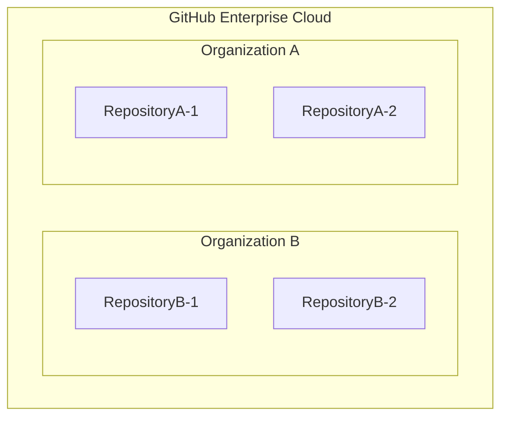
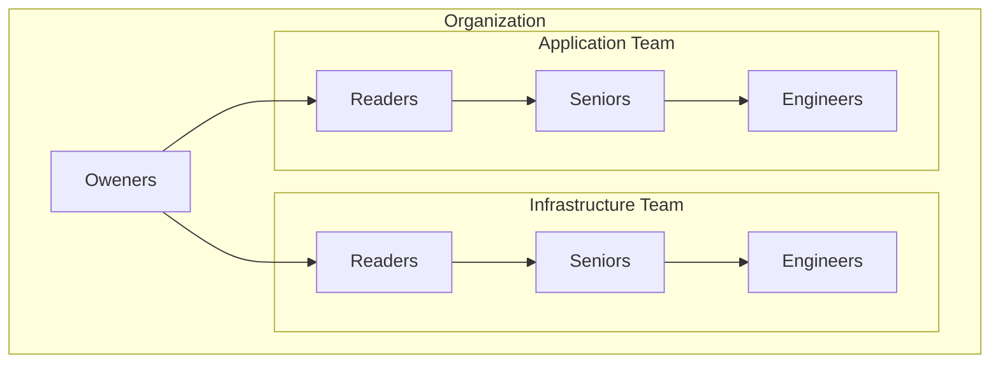

# GitHub Organization 基本設計書

## 1. 概要

### 1.1 目的

本設計書は、プロジェクトにおける GitHub Organization の利用方針および運用ルールを定義することを目的としています。この設計書に基づいて開発プロセスを標準化し、効率的なチーム開発とコード品質の向上を実現します。

本書で定義する内容は以下の通りです：

- チーム構造とロールの定義
- 権限管理とアクセス制御
- レビュープロセスとワークフロー
- セキュリティとコンプライアンスの基準

### 1.2 対象範囲

本設計書、GitHub Enterprise Cloud における Organization の利用に関する基本的な設計を、組織構造、権限管理、リポジトリ運用、開発ワークフロー、品質管理の各側面について規定します。

CI/CD パイプライン、コーディングルールなどは別途定める開発ガイドラインにて規定するものとし、本設計書の対象外とします。
また、GitHub Enterprise の設計についても本設計の対象外とします。GitHub Enterprise Cloud と GitHub Organization の関係を以下の図に示します。



Git リポジトリは Organization 単位で管理され、プロジェクト単位に Organization を割り当て権限管理をすることで、お互いのプロジェクトのリポジトリを参照できないようにします。

### 1.3 対象読者

本設計書は、以下の役割を持つメンバーを対象としています：

| メンバー         | 役割                                                          |
| ---------------- | ------------------------------------------------------------- |
| オーナー         | GitHub の管理者、プロジェクトマネージャー、プロダクトオーナー |
| チームリーダー   | チームの責任者                                                |
| シニアエンジニア | 上級開発エンジニア                                            |
| エンジニア       | 開発エンジニア                                                |

### 1.4 用語定義

| 用語            | 説明                                                               |
| --------------- | ------------------------------------------------------------------ |
| Organization    | GitHub の組織アカウント。複数のリポジトリやチームを管理する単位    |
| Repository      | ソースコードやドキュメントの格納場所。バージョン管理される最小単位 |
| Team            | Organization 内のグループ単位。権限やアクセス制御の管理単位        |
| Branch          | リポジトリ内のコード分岐。並行開発を可能にする機能                 |
| Pull Request    | コードレビューと変更の統合プロセス（以下 PR）                      |
| Issue           | タスク・バグ・要望の管理単位                                       |
| Review          | コードやドキュメントのレビュープロセス                             |
| Approve         | レビュー完了後の承認                                               |
| Merge           | ブランチの統合作業                                                 |
| Protection Rule | ブランチの保護設定                                                 |

## 2. Organization 設計

### 2.1 メンバーの役割定義

Organization に所属するメンバーの役割を以下のように定義します。

| メンバー         | 主な役割                                                                 |
| ---------------- | ------------------------------------------------------------------------ |
| オーナー         | システム全体の品質保証、本番環境の管理                                   |
| リーダー         | アーキテクチャ設計、チーム開発方針の策定、コードの最終承認               |
| シニアエンジニア | エンジニアの役割に加え、技術的判断、コードレビュー、エンジニアの技術支援 |
| エンジニア       | 機能実装、ユニットテスト作成、ドキュメント作成                           |

### 2.2 Team 構成

GitHub における Orgnization 内の Team 機能を使用し、以下の階層構造で権限管理を行います。



（補足）Application と Infrastructure の Team には具体的な権限を付与せず、論理的なグループとしてのみ使用します。

各 Team に所属するメンバーを以下に示します。

| Team                     | 所属メンバー                     |
| ------------------------ | -------------------------------- |
| Owners                   | オーナー                         |
| Application              | アプリチームのメンバー           |
| Application/Readers      | アプリチームのリーダー           |
| Application/Seniors      | アプリチームのシニアエンジニア   |
| Application/Engineers    | アプリチームのエンジニア         |
| Infrastructure           | インフラチームメンバー           |
| Infrastructure/Readers   | インフラチームのリーダー         |
| Infrastructure/Seniors   | インフラチームのシニアエンジニア |
| Infrastructure/Engineers | インフラチームのエンジニア       |

この組織構造により、以下を実現します。

1. 柔軟なメンバー管理

   - 個人を Team に所属させることで、個人の指定なしで権限管理が可能
   - メンバーの昇格時は Team の所属を変更するだけで権限が自動的に更新
   - 退職時は Team から削除するだけで全ての権限が削除

2. 段階的な権限付与
   - Engineers: 基本的な開発権限
   - Seniors: レビュー承認権限
   - Leaders: 環境固有の承認権限

### 2.3 権限定義

GitHub における権限は以下の 3 つのレベルに分かれています。

- Organization
- Team
- Repository

それぞれのレベルにはロールがあり、以下でそのロールを示します。

#### Organization レベルのロール

Organization 全体に対する権限を定義するロールです。

| ロール | 説明                                                                          |
| ------ | ----------------------------------------------------------------------------- |
| Owner  | Organization の管理者権限。全ての設定変更、メンバー管理、支払い管理などが可能 |
| Member | Organization のメンバーとして基本的な操作が可能                               |

#### GitHub の Team レベルのロール

Team 内での権限を定義するロールです。

| ロール     | 説明                                                            |
| ---------- | --------------------------------------------------------------- |
| Maintainer | チームの管理者権限。メンバーの追加・削除、Team 設定の変更が可能 |
| Member     | チームのメンバーとして基本的な操作が可能                        |

#### GitHub の Repository レベルロール

リポジトリに対する権限を定義するロールです。

| ロール   | 説明                                                       |
| -------- | ---------------------------------------------------------- |
| Admin    | リポジトリの管理者権限。全ての設定変更とアクセス管理が可能 |
| Maintain | リポジトリの管理（設定変更を除く）とコードの変更が可能     |
| Write    | コードの変更と Pull Request の作成が可能                   |
| Triage   | Issue や Pull Request の管理が可能（コード変更不可）       |
| Read     | 読み取りのみ可能                                           |

### 2.4 承認権限の設定

#### Team へのロール割り当て

各レベルのロールを Team に割り当てることで Team に対して適切な権限設定を行います。

| Team                     | Organization Role | Team Role  | Repository Role |
| ------------------------ | ----------------- | ---------- | --------------- |
| Owners                   | Owner             | -          | -               |
| Application              | Member            | -          | -               |
| Application/Leaders      | Owner             | Maintainer | Admin           |
| Application/Seniors      | Member            | Maintainer | Admin           |
| Application/Engineers    | Member            | Member     | Write           |
| Infrastructure           | Member            | -          | -               |
| Infrastructure/Leaders   | Owner             | Maintainer | Admin           |
| Infrastructure/Seniors   | Member            | Maintainer | Admin           |
| Infrastructure/Engineers | Member            | Member     | Write           |

#### ブランチ保護ルール

各ブランチには以下の保護ルールを設定します。

| ブランチ   | 必要な承認             | マージ権限       | 追加設定                         |
| ---------- | ---------------------- | ---------------- | -------------------------------- |
| production | Owners の承認          | Owners のみ      | 承認必須、ステータスチェック必須 |
| staging    | Leaders の承認         | Leaders のみ     | 承認必須、ステータスチェック必須 |
| develop    | Seniors/Leaders の承認 | Write 権限保持者 | 承認必須、ステータスチェック必須 |

#### Code Owners の設定

各ブランチに対して.github/CODEOWNERS の設定をすることで、ブランチ全体に対する制限を設定します。

```text
# デフォルトのCode Owner設定
*                   @Organization/Infrastructure/Seniors @Organization/Application/Seniors
                    @Organization/Infrastructure/Leaders @Organization/Application/Leaders

# productionブランチ全体の所有者設定
production          @Organization/Owners

# stagingブランチ全体の所有者設定
staging             @Organization/Infrastructure/Leaders @Organization/Application/Leaders

# developブランチ全体の所有者設定
develop             @Organization/Infrastructure/Seniors @Organization/Application/Seniors
                    @Organization/Infrastructure/Leaders @Organization/Application/Leaders
```

#### 権限の優先順位

GitHub における権限制御は、以下の順序で優先されます。

1. Branch Protection Rules / CODEOWNERS（最優先）

   - ブランチごとの保護設定
   - マージ制限、承認要件
   - コードオーナーの指定
   - 例：production ブランチへのマージには Owner の承認が必須

2. Repository Level（中間）

   - リポジトリごとの権限設定
   - Repository Role（Admin, Maintain, Write 等）による基本権限
   - 例：Admin 権限を持っていても、Branch Protection の制限は上書きできない

3. Organization Level（最低位）
   - Organization 全体の設定
   - Team や Member の基本権限
   - 例：Organization Member であっても Repository 権限がなければアクセス不可

この優先順位により、上位の設定が下位の設定を上書きします。例えば、Repository Role で Admin 権限を持つユーザーでも、Branch Protection や CODEOWNERS の設定により、特定のブランチへのマージや承認が制限されます。

### 2.5 操作権限マトリクス

| 操作権限                  | オーナー | リーダー | シニアエンジニア | エンジニア |
| ------------------------- | :------: | :------: | :--------------: | :--------: |
| **Organization Level**    |          |          |                  |            |
| Organization 設定変更     |    ✅    |    ✅    |        ❌        |     ❌     |
| Team 作成・削除           |    ✅    |    ✅    |        ❌        |     ❌     |
| メンバー管理              |    ✅    |    ✅    |        ❌        |     ❌     |
| Billing 管理              |    ✅    |    ✅    |        ❌        |     ❌     |
| **Team Level**            |          |          |                  |            |
| Team 設定変更             |    ✅    |   ✅\*   |       ✅\*       |     ❌     |
| Team メンバー管理         |    ✅    |   ✅\*   |       ✅\*       |     ❌     |
| **Repository Level**      |          |          |                  |            |
| リポジトリ作成            |    ✅    |    ✅    |        ✅        |     ❌     |
| リポジトリ設定変更        |    ✅    |    ✅    |        ✅        |     ❌     |
| ブランチ保護設定          |    ✅    |    ✅    |        ✅        |     ❌     |
| Webhooks 設定             |    ✅    |    ✅    |        ✅        |     ❌     |
| セキュリティ設定          |    ✅    |    ✅    |        ✅        |     ❌     |
| PR のマージ（production） |    ✅    |    ✅    |        ❌        |     ❌     |
| PR のマージ（staging）    |    ✅    |    ✅    |        ✅        |     ❌     |
| PR のマージ（develop）    |    ✅    |    ✅    |        ✅        |     ✅     |
| PR の承認（production）   |    ✅    |    ✅    |        ❌        |     ❌     |
| PR の承認（staging）      |    ✅    |    ✅    |        ✅        |     ❌     |
| PR の承認（develop）      |    ✅    |    ✅    |        ✅        |     ❌     |
| PR のレビュー             |    ✅    |    ✅    |        ✅        |     ❌     |
| Issue 管理                |    ✅    |    ✅    |        ✅        |     ✅     |
| コードの Push             |    ✅    |    ✅    |        ✅        |     ✅     |

- ✅\* は「自身が所属する Team のみ可能」を示します。

## 3 保護ブランチ設計

GitHub のブランチ保護機能を利用して、保護対象ブランチ（production、staging、develop）の変更を制御します。この設定により、意図しない変更の防止と、適切なレビュープロセスの実施を強制します。

### 3.1 ブランチ保護の基本方針

1. 直接的な変更の防止

   保護対象ブランチへの直接的なプッシュを禁止し、すべての変更を Pull Request を通じて行うことを強制します。
   これにより、すべての変更に対してレビューを確実に実施します。

2. 段階的な承認プロセス

   環境ごとに異なる承認要件を設定し、変更の重要度に応じた承認プロセスを実現します。
   production 環境への変更は最も厳格な承認プロセスを必要とします。

3. 品質チェックの強制

   develop 保護ブランチで、マージ前のステータスチェック（UT）の通過を必須とします。
   コードの品質基準を満たすことを保証します。

4. レビュー承認の破棄

   - 新しいコミットがプッシュされた際は、既存の承認を自動的に破棄します。
   - これにより、変更後のコードに対する再レビューを強制します。

5. 会話の解決要件

   - すべての保護ブランチで、PR のレビューコメントの解決を必須としています。
   - これにより、レビューで指摘された問題の確実な対応を促します。

### 3.2 保護ブランチの設定

#### 具体的な保護設定

Github のブランチ保護ルールの設定項目、その内容、および各ブランチでの有効状態をまとめます。

| 設定項目（英語）                                                 | 設定内容の説明（日本語）                                         | develop                   | staging         | production     |
| ---------------------------------------------------------------- | ---------------------------------------------------------------- | ------------------------- | --------------- | -------------- |
| Required Reviews                                                 | PR を必須とし、直接のマージを禁止する                            | ✓                         | ✓               | ✓              |
| Required number of approvals                                     | レビュー承認者の必要人数（1 名）                                 | ✓                         | ✓               | ✓              |
| Dismiss stale pull request approvals when new commits are pushed | 新しいコミットがプッシュされた際に、既存の承認を無効化する       | ✓                         | ✓               | ✓              |
| Require review from Code Owners                                  | コードオーナーからのレビュー承認を必須とする                     | ✓                         | ✓               | ✓              |
| Restrict who can dismiss pull request reviews                    | PR のレビューを却下できる権限者を制限する                        | -                         | Leaders/Seniors | Owners/Leaders |
| Require status checks to pass before merging                     | ステータスチェックの通過をマージの条件とする                     | ✓                         | ✓               | ✓              |
| Require branches to be up to date before merging                 | マージ前にターゲットブランチに対して最新状態であることを要求する | ✓                         | ✓               | ✓              |
| Required status checks\*                                         | マージ前に通過が必要なステータスチェック項目を指定する           | 静的解析/ lint-check / UT | -               | -              |
| Require conversation resolution before merging                   | すべての会話（コメント）が解決済みであることをマージの条件とする | ✓                         | ✓               | ✓              |
| Include administrators                                           | 管理者に対してもこれらの制限を適用する                           | ✓                         | ✓               | ✓              |
| Restrict who can push to matching branches                       | 対象ブランチへの直接プッシュができる権限者を制限する             | -                         | -               | -              |

- \* 必要なチェックは開発側と検討して実装します。

## 4. Pull Request 設計

Pull Request（PR）を用いた開発ワークフローについて定義します。

### 4.1 Pull Request とは

Pull Request（以下、PR）は、コードの変更内容をチームメンバーと共有し、レビューを受けるための GitHub の機能です。PR を通じて、コードの品質維持、知識の共有、およびチーム内のコラボレーションを促進します。

PR では以下の作業を行います。

- コードの差分の確認
- レビューコメントの投稿
- コードに対する提案
- 議論のスレッド管理
- CI による自動テストの実行

### 4.2 Pull Request フロー

develop ブランチに変更を merge する際には以下のフローで作業を行います。

1. ブランチの作成

   開発者は作業用のブランチを作成します。ブランチ名は定められた命名規則に従います。

2. コードの実装

   作業用ブランチで必要な実装を行います。このとき、以下の点に注意します。

   - コミットは論理的な最小単位で行う
   - コミットメッセージは明確に記述する
   - 開発ガイドラインに従った実装を行う

3. コードの Push

   実装したコードをリモートリポジトリにプッシュします。この時点で以下が自動実行されます。

   - GitHub Actions による CI の実行
     - 静的解析
     - 単体テスト（UT）
     - リンターチェック
   - CI の結果は GitHub 上で確認可能

   CI によるテストにパスしないと PR の作成が行えません。

4. PR の作成

   CI が成功したことを確認後、以下の手順で PR を作成します。

   - 適切なブランチをマージ先として選択
   - PR template に従って内容を記述
   - レビュアーを 1 名以上指定（該当環境に応じた権限を持つメンバー）
   - 関連する Issue をリンク（あれば）

5. レビュープロセス

   以下の流れでレビューを実施します。

   - レビュアーによるコードレビュー
   - レビューコメントへの対応
   - 必要に応じてコードの修正

   すべてのレビューコメントが解決され、必要な承認が得られるまでこのプロセスを繰り返します。

6. マージの実行

   必要な承認と CI チェックが完了したら、PR 作成者が以下を確認してマージを実行します。

   - 必要な承認が得られていること
   - すべてのレビューコメントが解決していること
   - コンフリクトが発生していないこと

develop から staging、staging から production に merge を行う際には、4 ～ 6 を実施します。

### 4.3 Pull Request Template

PR template の内容を以下に規定します。

```markdown
## 概要

<!-- 変更の目的と概要を記載してください -->

## 変更内容

<!-- 具体的な変更内容を箇条書きで記載してください -->

## テスト内容

<!-- 実施したテストの内容を記載してください -->
<!-- エビデンスは直接貼り付けるかリンクを付けてください -->

## レビュー項目

<!-- レビュアーに特に確認して欲しい点があれば記載してください -->

## 関連チケット

<!-- 関連するチケット番号があれば記載してください -->
```

以下に PR の例を示します。

```text
## 概要

S3バケット監視用Lambda関数に、CloudWatch Logsへの詳細なログ出力機能を追加しました。これにより、ファイル監視とSNS通知の実行状況をより詳細に把握できるようになり、トラブルシューティングが容易になります。

## 変更内容

- Lambda関数（`s3_monitor.py`）に以下のログ出力を追加：
  - S3イベント受信時のイベント内容（バケット名、オブジェクトキー、イベントタイプ）
  - SNSメッセージ送信前の通知内容
  - 処理の開始・完了タイミング
  - エラー発生時の詳細情報

- IAMロール設定の更新：
  - CloudWatch Logsへの書き込み権限（`logs:CreateLogStream`、`logs:PutLogEvents`）を追加

## テスト内容

1. ローカル環境でのテスト

# テストケース実行結果
test_s3_event_logging: PASS
test_sns_message_logging: PASS
test_error_logging: PASS

2. AWS環境での動作確認
- S3バケットへのファイルアップロード
- CloudWatch Logsでのログ確認

START RequestId: 123e4567-e89b-12d3-a456-426614174000
2024-01-01T00:00:00.000Z [INFO] Received S3 event for bucket: my-bucket, key: test.txt
2024-01-01T00:00:01.000Z [INFO] Sending SNS notification: File test.txt uploaded to my-bucket
2024-01-01T00:00:02.000Z [INFO] SNS notification sent successfully
END RequestId: 123e4567-e89b-12d3-a456-426614174000

## レビュー項目

- ログレベルの適切性（INFO/ERROR）の選定
- ログ出力による関数の実行時間への影響
- 出力内容に機密情報が含まれていないことの確認
- エラー時のログ出力フォーマットの妥当性

## 関連チケット

INFRA-789: Lambda関数のログ出力機能強化
```

### 4.4 レビュープロセス

各環境に応じたレビューレビュアーを以下のように定義します。

| 環境       | レビュー要件                                 | レビュー観点                                                       |
| ---------- | -------------------------------------------- | ------------------------------------------------------------------ |
| develop    | シニアエンジニアまたはリーダーによるレビュー | 実装の妥当性、テストの十分性、アーキテクチャ整合性                 |
| staging    | シニアエンジニアまたはリーダーによるレビュー | develop 環境でのテスト結果の妥当性、セキュリティ考慮               |
| production | オーナーまたはリーダーによるレビュー         | staging 環境でのテスト結果の妥当性、性能への影響、リリース要件充足 |

レビューについては 6 章の「レビュー方針」で詳しく記載します。

## 5 Issue 管理

### 5.1 Issue とは

Issue は、プロジェクトにおけるタスク、バグ、機能要望などを管理するための GitHub の機能です。チケットとしても使用され、以下のような用途で活用されます。

- バグ報告の管理
- 機能要望の記録
- タスクの進捗管理
- 議論のスレッド管理

Issue には以下の特徴があります。

- 一意の番号が付与される
- ラベルによる分類が可能
- 担当者の割り当てが可能
- PR との相互リンクが可能
- コメントによる議論が可能

### 5.2 Issue template

Issue template の内容を以下に規定します。

```markdown
## バグ報告テンプレート

### 発生環境

- 環境：
- ブラウザ/バージョン：

### 再現手順

1.
2.

### 期待動作

### 実際の動作

### スクリーンショット（あれば）

---

## 機能要望テンプレート

### 概要

### 目的・背景

### 提案内容

### 期待される効果
```

### 5.3 Issue 運用ルール

プロジェクトでは、効率的なタスク管理とコミュニケーションを実現するため、以下のように Issue を運用します。

1. Issue 作成のタイミング

   以下の場合に Issue を作成します。

   - バグを発見したとき
   - 新機能や改善の提案があるとき
   - 定義された作業単位の実装を開始するとき

2. Issue 管理のプラクティス

   効率的な管理のため、以下の運用ルールを設けます。

   - 作業開始時には担当者を割り当てる
   - 進捗状況は適宜コメントで更新する
   - 関連する PR は Issue にリンクする
   - クローズ時は対応結果を必ず記載する

3. クローズの条件

   以下の条件を満たした際に Issue をクローズします。

   バグ報告の場合：

   - 修正が完了し、テストで確認できた場合
   - 仕様通りの動作と判明した場合
   - 再現性が確認できず、報告者も同意した場合

   機能要望の場合：

   - 実装が完了し、テストで確認できた場合
   - 実装しないことが決定し、関係者の同意を得た場合
   - 別の方法で要件が満たされることになった場合

   タスクの場合：

   - 作業が完了し、成果物のレビューが完了した場合
   - タスクが不要となり、関係者の同意を得た場合

## 6. レビュー方針

### 6.1 レビューの目的

コードレビューは、プロジェクトの品質を維持・向上させるための重要なプロセスであり、レビューを通じて、早期のバグ発見、コードの品質維持、設計の一貫性確保を実現します。

### 6.2 レビュー基準

コードレビューでは、複数の観点から総合的にコードの質を評価します。各観点について、具体的な確認項目と評価基準を以下に示します。

1. 機能面の確認

   - 仕様との整合性
   - ロジックの正確性
   - エラー処理の妥当性
   - パフォーマンスへの影響

2. 品質面の確認

   - テストコードの網羅性
   - エッジケースの考慮
   - 並行処理の考慮
   - リソース管理の適切性

3. セキュリティ面の確認

   - 認証・認可の適切性
   - 入力値の検証
   - 機密情報の扱い
   - 脆弱性対策の妥当性

4. 保守性の確認
   - コードの可読性
   - 命名の適切性
   - コメントの妥当性
   - 重複コードの有無

### 6.3 承認基準

環境ごとに以下の承認基準を設けます。

1. develop 環境

   - シニアエンジニアまたはリーダーによる承認が必要
   - テストコードが含まれていること
   - CI のすべてのチェックがパスしていること

2. staging 環境

   - シニアエンジニアまたはリーダーによる承認が必要
   - develop 環境での動作確認が完了していること
   - セキュリティが考慮されていること

3. production 環境
   - オーナーによる承認が必要
   - staging 環境での検証が完了していること
   - 性能要件を満たしていること

### 6.4 レビューコメントのガイドライン

レビューコメントは、建設的かつ明確な内容とし、改善につながる具体的な提案を含めることが重要であり、以下のガイドラインに従ってコメントを記述します。

#### コメントの基本方針

- 問題点を具体的に説明する
- 改善案を提示する
- 建設的な表現を使用する
- 必要に応じてコード例を示す

#### 重要度の分類

レビューコメントには、以下の重要度を明記します。

| 分類       | 説明             | 対応要否       |
| ---------- | ---------------- | -------------- |
| [Must]     | 重大な問題あり   | 必ず修正       |
| [Should]   | 改善が望ましい   | 可能な限り修正 |
| [Question] | 確認・説明が必要 | 回答必須       |
| [IMO]      | 提案・意見       | 任意対応       |

(補足)IMO・・・In My Opinion

### 6.5 指摘事項への対応方法

レビューコメントへの対応は、以下のプロセスで行います。

1. コメントの確認と理解

   - 指摘内容の確認
   - 必要に応じて詳細の確認
   - 対応方針の検討

2. 修正の実施

   - コードの修正
   - テストの追加・修正
   - ドキュメントの更新

3. 対応の完了

   - コメントへの返信
   - 修正内容の説明
   - Resolve による完了マーク

### 6.6 差し戻し時の対応

重大な問題が発見された場合、レビューを差し戻すことがあります。その場合の対応プロセスは以下の通りです。

#### 差し戻しの判断基準

以下のいずれかに該当する場合、レビューを差し戻します。

| 条件               | 例                   | 対応方針               |
| ------------------ | -------------------- | ---------------------- |
| 仕様との不整合     | 要件を満たしていない | 仕様の再確認と修正     |
| セキュリティリスク | 脆弱性の存在         | セキュリティ対策の実装 |
| 重大なバグ         | データ不整合の可能性 | ロジックの見直し       |
| 性能問題           | 著しい性能劣化       | アルゴリズムの改善     |

### 再レビュープロセス

差し戻し後の対応は、以下の手順で進めます。

- 指摘事項の分析と対応計画の作成
- 必要に応じた設計の見直し
- コードの修正とテストの実施
- 修正内容の文書化と説明の準備
- レビューの再依頼

## 7. 運用管理

### 7.1 リポジトリ管理

リポジトリは開発資産を格納・管理する重要な場所であり、適切な設定と制御が必要です。新規リポジトリ作成時には、一貫性のある管理と安全な開発を実現するため、以下の標準設定を適用します。

#### 基本設定

| 設定項目              | 設定値       | 目的                               |
| --------------------- | ------------ | ---------------------------------- |
| Default branch        | develop      | 標準的な命名規則の採用             |
| Repository visibility | Private      | 意図しない情報公開の防止           |
| Merge button          | Squash merge | コミット履歴の整理                 |
| Allow auto-merge      | Disabled     | レビュー徹底の保証                 |
| Allow squash merge    | Enabled      | コミット履歴を整理してマージ可能に |
| Allow merge commits   | Disabled     | 直接マージの防止                   |
| Allow rebase merge    | Disabled     | 履歴改変の防止                     |

#### 必須ファイル設定

リポジトリの標準化と効率的な運用のため、以下のファイルを必須とします：

- `.github/CODEOWNERS`: コードレビュー担当者の明確化
- `.github/pull_request_template.md`: PR フォーマットの統一
- `.github/issue_template.md`: issue 管理の標準化
- `.gitignore`: 不要ファイルの管理除外
- `README.md`: プロジェクト概要の明示

### 7.2 Repository Template

効率的なリポジトリ作成と標準化を実現するため、リポジトリテンプレートを用意します。

#### テンプレートに含まれる共通要素

1. 基本設定ファイル
   - 前述の必須ファイル設定に記載のファイル
2. ブランチ保護ルール
   - ブランチの保護設定
   - レビュー必須化設定
   - マージ条件設定

### 7.3 セキュリティ

#### 認証とアクセス制御

開発資産を保護するため、認証メカニズムを採用します。以下の設定により、アカウントセキュリティを確保します。

#### 認証設定

- 2 要素認証（2FA）の必須化
- 認証アプリまたはセキュリティキーの推奨
- アクセストークンの 90 日有効期限制限
- SSH キーの 180 日更新必須

#### Organization 制限

| 制限項目                         | 設定                    | 理由                                       |
| -------------------------------- | ----------------------- | ------------------------------------------ |
| Repository creation              | Owners and Leaders only | プロジェクト管理の効率化と適切な管理の両立 |
| Allow forking                    | Disabled                | コード流出の防止                           |
| Allow private repository forking | Disabled                | 管理の一元化                               |

#### 脆弱性管理

コードの安全性を継続的に監視するため、以下のセキュリティ機能を標準で有効化します。

1. **Secret Scanning**

   - 全リポジトリでの自動スキャン
   - プッシュ時の即時検査
   - 検出時の自動通知

2. **Dependabot 設定**

   - 脆弱性の検知とアラートの通知
   - 検知された脆弱性に対して対策の提案

#### アクセス制御と監査

組織のセキュリティを確保するため、以下のアクセス制御を実施します。

- IP 制限
  - 開発拠点からのアクセスのみ許可
  - 例外的なアクセスは個別審査
